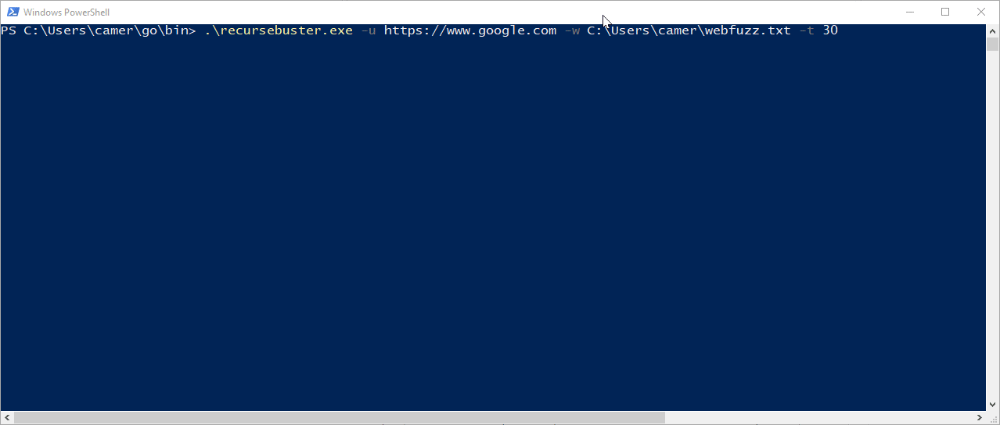

# RecurseBuster

[](https://goreportcard.com/report/github.com/c-sto/recursebuster)



It's like gobuster, but recursive!

I wanted a recursive directory brute forcer that was fast, and had certain features (like header blacklisting, and recursion). It didn't exist, so I started writing this. In reality, I'll probably merge a lot of the functionality into github.com/swarley7/gograbber since that solves a similar problem and has cool features that I don't want to implement (phantomjs, ugh). For now, it will do.

## Installation

Ye olde go get install should work. Same command to update:

```
go get -u github.com/c-sto/recursebuster
```

Important releases will also be tagged and uploaded.

**NOTE** Since tagged releases have started, some old versions which have been obtained with `go get -u` seem to be broken. Removing the folder and starting again seems to work:

```
rm -rf $GOPATH/src/github.com/c-sto/recursebuster
rm $GOPATH/bin/recursebuster
go get -u github.com/c-sto/recursebuster
```

## Usage

I wanted it to be fairly straightforward, but scope creep etc. Basic usage is just like gobuster:

```
recursebuster -u https://google.com -w wordlist.txt
```

This will run a recursive-HEAD-spider-assisted search with a single thread on google.com using the wordlist specified above. Results will print to screen, but more importantly, will be written to a file 'busted.txt'.

## Features

### HEAD Based Checks

For servers the support it, HEAD based checks speed up content discovery considerably, since no body is required to be transferred. The default logic is to use a HEAD request to determine if something exists. If it seems to exist, a GET is sent to retrieve and verify. If there are sensitive pages that perform actions (AKA, ones that don't really follow the HTTP Verb Spec), a file containing a list of *exact* URLS that should not requested can be blacklisted with the `-blacklist` flag.

### Recursion

When a directory is identified, it gets added to the queue to be brute-forced. By default, one directory is brute-forced at a time, however you can 'cancel' a directory interactively by hitting 'ctrl+x' if in UI mode. If you're not in UI mode (`-noui`), you need to have added the directory to the blacklist.

### Spider Assistance

Since we are getting the page content anyway, why not use it to our advantage? Some basic checks are done to look for links within the HTML response. The links are added, and any directories identified added too. By default, only the supplied host is whitelisted, so any links that go off-site (rather, to a different domain) are ignored. You can specify a file that contains a list of whitelisted domains that you are OK with including into the spider with the `-whitelist` flag.

### Speed

Gobuster is pretty fast when you smash `-t 200`, but who would do that? One of my goals for this was to keep performance on-par with gobuster where possible. On most webservers, recursebuster seems to be faster, even though it sends both a HEAD and a GET request. This means you will hit WAF limits really quickly, and is why by default it's `-t 1`.

### Proxy options

The ability to use a proxy is fairly useful in several situations. Not having to drop tools on a host in order to scan through it is always useful - recursebuster also works through burp if you specify it as a http proxy. When using Recursebuster to supplement the burp sitemap - use the `-stitemap` option to send _only_ the 'found' or interesting responses to burp, this should help avoid filling up your HTTP History with 404's.

## Usage args

Idk why you might want these, just run it with `-h 2>&1` and grep for the keyword. Here they are anyway:

```
  -ajax
        Add the X-Requested-With: XMLHttpRequest header to all requests
  -all
        Show, and write the result of all checks
  -appendslash
        Append a / to all directory bruteforce requests (like extension, but slash instead of .yourthing)
  -auth string
        Basic auth. Supply this with the base64 encoded portion to be placed after the word 'Basic' in the Authorization header.
  -bad string
        Responses to consider 'bad' or 'not found'. Comma-separated. This works the opposite way of gobuster! (default "404")
  -badheader value
        Check for presence of this header. If an exact match is found, the response is considered bad.Supply as key:value. Can specify multiple - eg '-badheader Location:cats -badheader X-ATT-DeviceId:XXXXX'
  -blacklist string
        Blacklist of prefixes to not check. Will not check on exact matches.
  -canary string
        Custom value to use to check for wildcards
  -clean
        Output clean URLs to the output file for easy loading into other tools and whatnot.
  -cookies string
        Any cookies to include with requests. This is smashed into the cookies header, so copy straight from burp I guess.
  -debug
        Enable debugging
  -ext string
        Extensions to append to checks. Multiple extensions can be specified, comma separate them.
  -headers value
        Additional headers to include with request. Supply as key:value. Can specify multiple - eg '-headers X-Forwarded-For:127.0.01 -headers X-ATT-DeviceId:XXXXX'
  -https
        Use HTTPS instead of HTTP.
  -iL string
        File to use as an input list of URL's to start from
  -k    Ignore SSL check
  -len
        Show, and write the length of the response
  -methods string
        Methods to use for checks. Multiple methods can be specified, comma separate them. Requests will be sent with an empty body (unless body is specified) (default "GET")
  -nobase
        Don't perform a request to the base URL
  -noget
        Do not perform a GET request (only use HEAD request/response)
  -nohead
        Don't optimize GET requests with a HEAD (only send the GET)
  -norecursion
        Disable recursion, just work on the specified directory. Also disables spider function.
  -nospider
        Don't search the page body for links, and directories to add to the spider queue.
  -nostartstop
        Don't show start/stop info messages
  -nostatus
        Don't print status info (for if it messes with the terminal)
  -noui
        Don't use sexy ui
  -nowildcard
        Don't perform wildcard checks for soft 404 detection
  -o string
        Local file to dump into (default "./busted.txt")
  -proxy string
        Proxy configuration options in the form ip:port eg: 127.0.0.1:9050. Note! If you want this to work with burp/use it with a HTTP proxy, specify as http://ip:port
  -ratio float
        Similarity ratio to the 404 canary page. (default 0.95)
  -redirect
        Follow redirects
  -sitemap
        Send 'good' requests to the configured proxy. Requires the proxy flag to be set. ***NOTE: with this option, the proxy is ONLY used for good requests - all other requests go out as normal!***
  -t int
        Number of concurrent threads (default 1)
  -timeout int
        Timeout (seconds) for HTTP/TCP connections (default 20)
  -u string
        Url to spider
  -ua string
        User agent to use when sending requests. (default "RecurseBuster/1.5.11")
  -v int
        Verbosity level for output messages.
  -version
        Show version number and exit
  -w string
        Wordlist to use for bruteforce. Blank for spider only
  -whitelist string
        Whitelist of domains to include in brute-force
```

Credits:

OJ/TheColonial: Hack the planet!!!!

Swarley: Hack the planet!!!!!

Hackers: Hack the planet!!!!